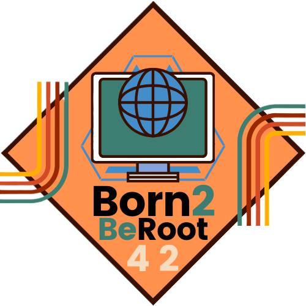

  
  <h2>42 BORN2BEROOT PROJECT</h2>
    
    
    
    
    
   
<h4>
    <a href="https://github.com/emre-mr246/42_ring1_born2beroot/issues">❔ Ask A Question</a>
   · 
    <a href="https://github.com/emre-mr246/42_ring1_born2beroot/issues">🪲 Report Bug</a>
   · 
    <a href="https://github.com/emre-mr246/42_ring1_born2beroot/issues">💬 Request Feature</a>
</h4>

## Introduction 🚀

The Born2BeRoot project is an assignment offered at Ecole 42 aimed at providing students with hands-on experience in system administration and security practices. Typically conducted on a Linux-based virtual machine.

## Objective 🎯
- **Virtual Machine Setup and Configuration**: Students install a specific Linux distribution on a virtual machine and perform basic configurations.
  
- **Network and Security Settings**: Post-installation, students configure network settings, implement security measures, and set up firewall rules.

- **Service Management**: Students configure and manage services such as web servers (Apache, Nginx, etc.) and SSH.

- **Disk Management**: Students learn disk partitioning and file system management.

Born2BeRoot project is designed to deepen students' understanding and experience in system administration and cybersecurity, making it a pivotal part of the Ecole 42 curriculum.
